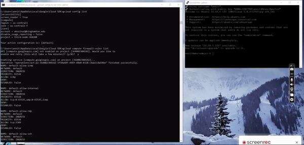
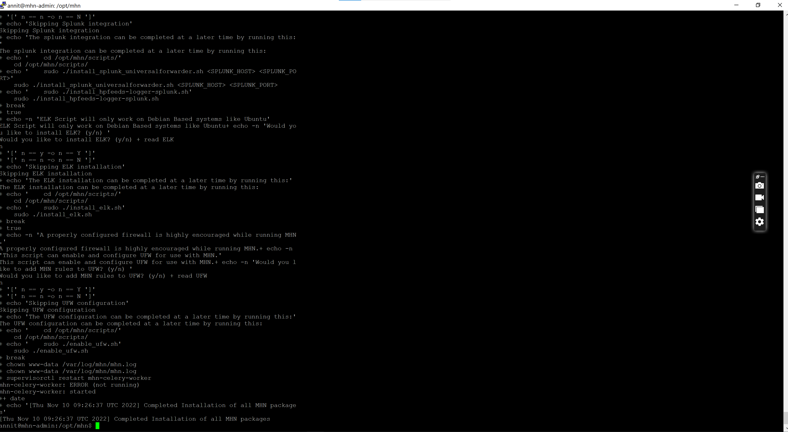
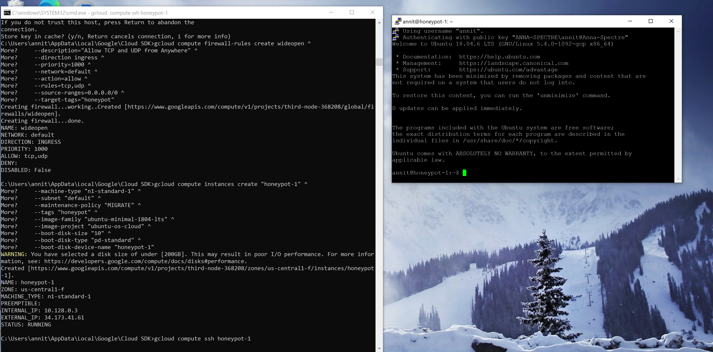
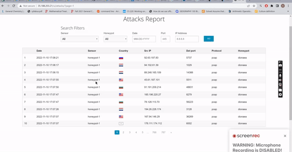
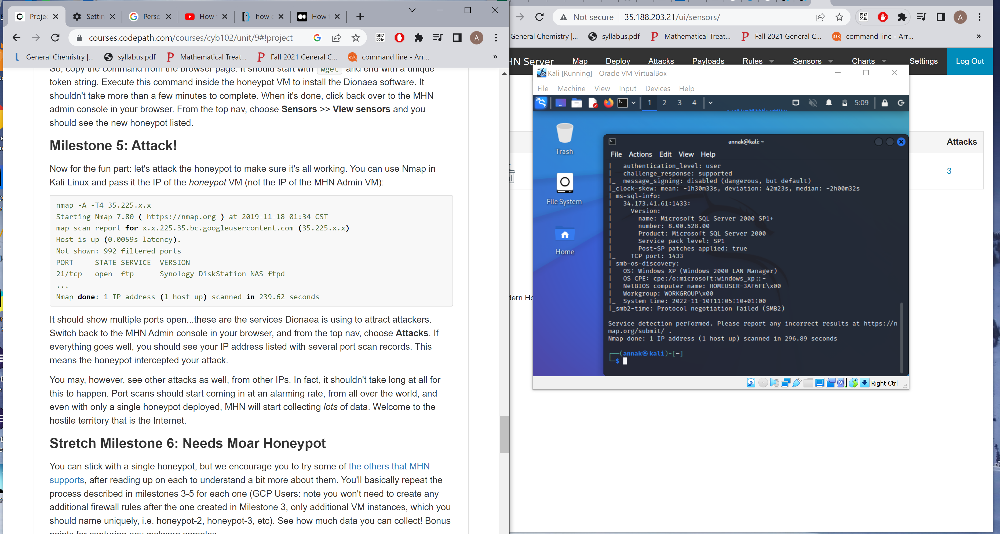
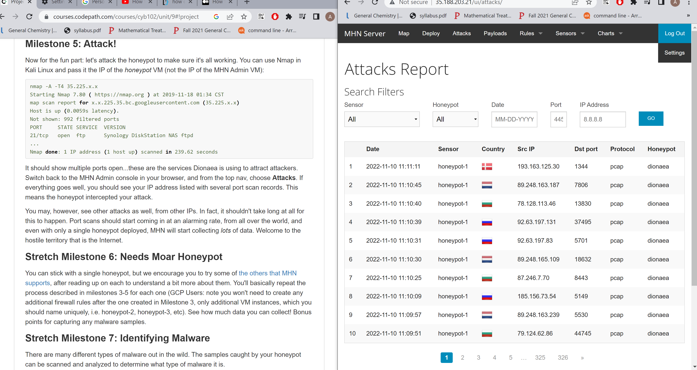
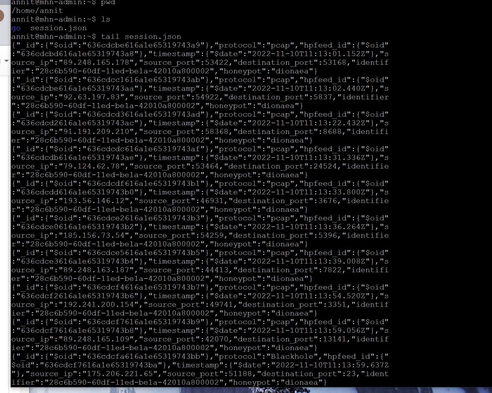

# Honeypot Assignment

**Time spent:** **10** hours spent in total
 All Miestone 0-5 completed
 Milestone 0: To the Cloud!
Milestone 1: Create MHN Admin VM

 Milestone 2: Install the MHN Admin Application

 Milestone 3: Create a MHN Honeypot VM

 Milestone 4: Install the Honeypot Application

 Milestone 5: Attack!

**Objective:** Create a honeynet using MHN-Admin. Present your findings as if you were requested to give a brief report of the current state of Internet security. Assume that your audience is a current employer who is questioning why the company should allocate anymore resources to the IT security team.

### MHN-Admin Deployment (Required)

**Summary:** How did you deploy it? Did you use GCP, AWS, Azure, Vagrant, VirtualBox, etc.?
I used the GCP and VirtualBox and followed all of the given MileStone 2 instructions for the project.

### Dionaea Honeypot Deployment (Required)
**Summary:** Briefly in your own words, what does dionaea do?
Then, I created a VM for the Dionaea Honey Pot. Dionaea is a type of honeypot that helps to capture attack paylods and malware.

### Database Backup (Required) 

**Summary:** What is the RDBMS that MHN-Admin uses? What information does the exported JSON file record?
MHN-Admin uses SQL as the RDBMS. The exported JSON file record has the inofrmation about the attack or the attacker that was done to the created honeypot (logs of such attacks).

*Be sure to upload session.json directly to this GitHub repo/branch in order to get full credit.*

## Notes

Describe any challenges encountered while doing the assignment.
I could not export session.json file to the local computer. Therefore, I will attach contents of it as a video here below!!.

